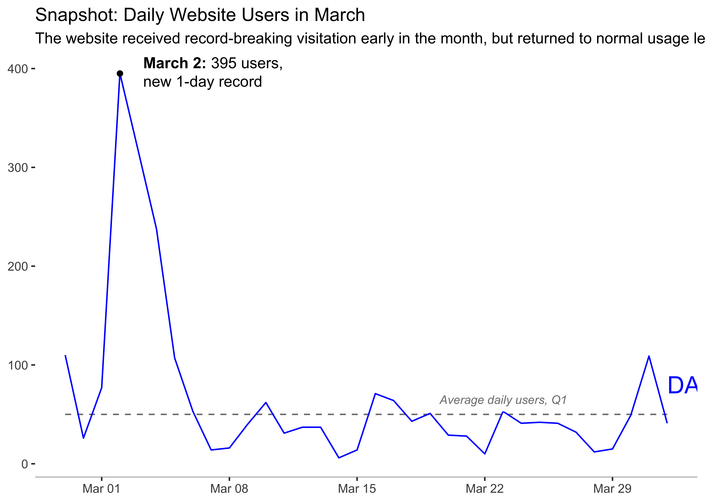

## Goals of this document

We want to convey the main trends of website visitation for the month of March. We'll read in some data, and examine the default plotting aspects of ggplot. Then we'll use design principles to clean up the plot for a more visually appealing and effective visualization. 

## Reading in data


::: {.cell layout-align="center"}

```{.r .cell-code}
library(tidyverse)

library(openxlsx)
```
:::

::: {.cell layout-align="center"}

```{.r .cell-code}
web_data <- read.xlsx(xlsxFile = "website_users.xlsx",
                      detectDates = TRUE)

head(web_data)
```

::: {.cell-output .cell-output-stdout}
```
        Date Daily_Users Average_Users
1 2021-02-27         110            50
2 2021-02-28          26            50
3 2021-03-01          77            50
4 2021-03-02         395            50
5 2021-03-03         317            50
6 2021-03-04         238            50
```
:::
:::


So we have the `Date` of each observation, the `Daily_Users` of that day, and the `Average_Users` for Q1. 

## Our first plot

Let's go ahead and make our first ggplot. I'm going to include *geoms* (data-driven shapes), labels, and titles so that we look similar to the example in the class, but leave the theme elements to ggplot's defaults. Note that unlike in Excel, the actual stuff you put on a ggplot are always additive - you need to "opt-in" to each thing, so our first "simple" plot is actually very complicated to make because there's a lot of business on it!


::: {.cell layout-align="center"}

```{.r .cell-code}
ggplot(web_data,
       aes(x = Date)) + 
  geom_line(aes(y = Average_Users), color = "black") + 
  geom_line(aes(y = Daily_Users), color = "blue") + 
  geom_point(aes(y = Average_Users), color = "black") + 
  geom_point(aes(y = Daily_Users), color = "blue") + 
  scale_x_date(breaks = "1 day") + 
  labs(title = "Snapshot: Daily Website Users in March",
       subtitle = "The website received record-breaking visitation early in the month, but returned to normal usage levels in the weeks that followed") + 
  theme(axis.text.x = element_text(angle = 90),
        plot.title = element_text(hjust = 0.5),
        plot.subtitle = element_text(hjust = 0.5)) 
```

::: {.cell-output-display}
{fig-align='center' width=2100}
:::
:::


Okay! We already start to see some differences between ggplot and Excel. For one, some aspects of this plot I had to go out of my way to make happen. I manually made the titles center-aligned, and I specified that each day should be on the x-axis label. Also ggplot doesn't favor gridlines, but uses what is now an infamous grey background. Let's simplify our plot first by getting rid of these steps which I manually did to make it worse.


::: {.cell layout-align="center"}

```{.r .cell-code}
ggplot(web_data,
       aes(x = Date)) + 
  geom_line(aes(y = Average_Users), color = "black") + 
  geom_line(aes(y = Daily_Users), color = "blue") + 
  geom_point(aes(y = Average_Users), color = "black") + 
  geom_point(aes(y = Daily_Users), color = "blue") + 
  labs(title = "Snapshot: Daily Website Users in March",
       subtitle = "The website received record-breaking visitation early in the month, but returned to normal usage levels in the weeks that followed")
```

::: {.cell-output-display}
{fig-align='center' width=2100}
:::
:::


That's already a bit better. Our titles are left-aligned, and the x-axis dates are much cleaner. Now we can start to reduce, similar to the lesson. First, let's remove that grey background, using `theme`. I'm also going to manually add in an x-axis line, with a light gray color.


::: {.cell layout-align="center"}

```{.r .cell-code}
ggplot(web_data,
       aes(x = Date)) + 
  geom_line(aes(y = Average_Users), color = "black") + 
  geom_line(aes(y = Daily_Users), color = "blue") + 
  geom_point(aes(y = Average_Users), color = "black") + 
  geom_point(aes(y = Daily_Users), color = "blue") + 
  labs(title = "Snapshot: Daily Website Users in March",
       subtitle = "The website received record-breaking visitation early in the month, but returned to normal usage levels in the weeks that followed") + 
  theme(panel.background = element_rect(fill = "white"),
        axis.line.x = element_line(color = "grey80"))
```

::: {.cell-output-display}
{fig-align='center' width=2100}
:::
:::


Let's also get rid of the `geom_point` calls - we don't need them!


::: {.cell layout-align="center"}

```{.r .cell-code}
ggplot(web_data,
       aes(x = Date)) + 
  geom_line(aes(y = Average_Users), color = "black") + 
  geom_line(aes(y = Daily_Users), color = "blue") + 
  labs(title = "Snapshot: Daily Website Users in March",
       subtitle = "The website received record-breaking visitation early in the month, but returned to normal usage levels in the weeks that followed") + 
  theme(panel.background = element_rect(fill = "white"),
        axis.line.x = element_line(color = "grey80"))
```

::: {.cell-output-display}
{fig-align='center' width=2100}
:::
:::


This is looking good! Let's simplify our Average_Users line, as well:


::: {.cell layout-align="center"}

```{.r .cell-code}
ggplot(web_data,
       aes(x = Date)) + 
  geom_line(aes(y = Average_Users), color = "grey50", linetype = "dashed") + 
  geom_line(aes(y = Daily_Users), color = "blue") + 
  labs(title = "Snapshot: Daily Website Users in March",
       subtitle = "The website received record-breaking visitation early in the month, but returned to normal usage levels in the weeks that followed") + 
  theme(panel.background = element_rect(fill = "white"),
        axis.line.x = element_line(color = "grey80"))
```

::: {.cell-output-display}
{fig-align='center' width=2100}
:::
:::


Because we'll convey this information contextually through the title, we can get rid of our axis titles. Note that for scientific audiences, this would be reversed (keep clean axis labels and remove titles)


::: {.cell layout-align="center"}

```{.r .cell-code}
ggplot(web_data,
       aes(x = Date)) + 
  geom_line(aes(y = Average_Users), color = "grey50", linetype = "dashed") + 
  geom_line(aes(y = Daily_Users), color = "blue") + 
  labs(title = "Snapshot: Daily Website Users in March",
       subtitle = "The website received record-breaking visitation early in the month, but returned to normal usage levels in the weeks that followed") + 
  theme(panel.background = element_rect(fill = "white"),
        axis.line.x = element_line(color = "grey80"),
        axis.title = element_blank())
```

::: {.cell-output-display}
{fig-align='center' width=2100}
:::
:::


Next, let's add some annotations, to highlight the *most important* information. We'll add these with the `annotate` function. We want to highlight the peak daily users. Let's first find out what day that was, and add it as an annotation.


::: {.cell layout-align="center"}

```{.r .cell-code}
arrange(web_data, desc(Daily_Users))
```

::: {.cell-output .cell-output-stdout}
```
         Date Daily_Users Average_Users
1  2021-03-02         395            50
2  2021-03-03         317            50
3  2021-03-04         238            50
4  2021-02-27         110            50
5  2021-03-31         109            50
6  2021-03-05         107            50
7  2021-03-01          77            50
8  2021-03-16          71            50
9  2021-03-17          64            50
10 2021-03-10          62            50
11 2021-03-06          53            50
12 2021-03-23          53            50
13 2021-03-19          51            50
14 2021-03-30          49            50
15 2021-03-18          43            50
16 2021-03-25          42            50
17 2021-03-24          41            50
18 2021-03-26          41            50
19 2021-04-01          41            50
20 2021-03-09          40            50
21 2021-03-12          37            50
22 2021-03-13          37            50
23 2021-03-27          32            50
24 2021-03-11          31            50
25 2021-03-20          29            50
26 2021-03-21          28            50
27 2021-02-28          26            50
28 2021-03-08          16            50
29 2021-03-29          15            50
30 2021-03-07          14            50
31 2021-03-15          14            50
32 2021-03-28          12            50
33 2021-03-22          10            50
34 2021-03-14           6            50
```
:::

```{.r .cell-code}
# Max Daily_Users was 395, on 2021-03-02.

ggplot(web_data,
       aes(x = Date)) + 
  geom_line(aes(y = Average_Users), color = "grey50", linetype = "dashed") + 
  geom_line(aes(y = Daily_Users), color = "blue") + 
  labs(title = "Snapshot: Daily Website Users in March",
       subtitle = "The website received record-breaking visitation early in the month, but returned to normal usage levels in the weeks that followed") + 
  theme(panel.background = element_rect(fill = "white"),
        axis.line.x = element_line(color = "grey80"),
        axis.title = element_blank()) + 
  annotate(geom = "point", 
           x = ymd("2021-03-02"),
           y = 395) + 
  annotate(geom = "text",
           x = ymd("2021-03-02"),
           y = 395,
           label = "March 2: 395 users, a new 1-day record")
```

::: {.cell-output-display}
{fig-align='center' width=2100}
:::
:::


Okay.... that's kinda ugly. Let's mess with the position and alignment of that label to make it look nice. I'll also split it into two lines, using the `\n` character.


::: {.cell layout-align="center"}

```{.r .cell-code}
ggplot(web_data,
       aes(x = Date)) + 
  geom_line(aes(y = Average_Users), color = "grey50", linetype = "dashed") + 
  geom_line(aes(y = Daily_Users), color = "blue") + 
  labs(title = "Snapshot: Daily Website Users in March",
       subtitle = "The website received record-breaking visitation early in the month, but returned to normal usage levels in the weeks that followed") + 
  theme(panel.background = element_rect(fill = "white"),
        axis.line.x = element_line(color = "grey80"),
        axis.title = element_blank()) + 
  annotate(geom = "point", 
           x = ymd("2021-03-02"),
           y = 395) + 
  annotate(geom = "text",
           x = ymd("2021-03-03"),
           y = 395,
           label = "March 2: 395 users,\na new 1-day record",
           hjust = 0)
```

::: {.cell-output-display}
{fig-align='center' width=2100}
:::
:::


What about bolding in labels? This is deceptively tricky in R. If the entire label is going to be bolded, we can add a `face = bold` argument to the `annotate` call. However, bolding sections of a label requires more functionality. To do this, we're going to install another package called ggtext that makes nice labels easier. I then use notation that's common for html (like `**` for bolded text and `<br>` for a line break) to make a nice, two-line label with the "March 2" bolded.


::: {.cell layout-align="center"}

```{.r .cell-code}
# install.packages("ggtext")

library(ggtext)


ggplot(web_data,
       aes(x = Date)) + 
  geom_line(aes(y = Average_Users), color = "grey50", linetype = "dashed") + 
  geom_line(aes(y = Daily_Users), color = "blue") + 
  labs(title = "Snapshot: Daily Website Users in March",
       subtitle = "The website received record-breaking visitation early in the month, but returned to normal usage levels in the weeks that followed") + 
  theme(panel.background = element_rect(fill = "white"),
        axis.line.x = element_line(color = "grey80"),
        axis.title = element_blank()) + 
  annotate(geom = "point", 
           x = ymd("2021-03-02"),
           y = 395) + 
  annotate(geom = "richtext",
           x = ymd("2021-03-03"),
           y = 395,
           label = "**March 2:** 395 users,<br>new 1-day record",
           label.color = NA,
           hjust = 0)
```

::: {.cell-output-display}
{fig-align='center' width=2100}
:::
:::


Yay! Let's go ahead and add some additional notations down near our data


::: {.cell layout-align="center"}

```{.r .cell-code}
ggplot(web_data,
       aes(x = Date)) + 
  geom_line(aes(y = Average_Users), color = "grey50", linetype = "dashed") + 
  geom_line(aes(y = Daily_Users), color = "blue") + 
  labs(title = "Snapshot: Daily Website Users in March",
       subtitle = "The website received record-breaking visitation early in the month, but returned to normal usage levels in the weeks that followed") + 
  theme(panel.background = element_rect(fill = "white"),
        axis.line.x = element_line(color = "grey80"),
        axis.title = element_blank()) + 
  annotate(geom = "point", 
           x = ymd("2021-03-02"),
           y = 395) + 
  annotate(geom = "richtext",
           x = ymd("2021-03-03"),
           y = 395,
           label = "**March 2:** 395 users,<br>new 1-day record",
           label.color = NA,
           hjust = 0) + 
  annotate(geom = "richtext",
           x = ymd("2021-03-20"),
           y = 53,
           label = "*Average daily users, Q1*",
           label.color = NA,
           size = 3,
           hjust = 0.1,
           vjust = 0,
           color = "grey50") + 
  annotate(geom = "text",
           x = ymd("2021-04-01"),
           y = 80,
           size = 6,
           color = "blue",
           label = "DAILY WEBSITE USERS",
           hjust = 0)
```

::: {.cell-output-display}
{fig-align='center' width=2100}
:::
:::


Okay! LOVE our *Average daily users* label, but ggplot is clipping the plotting area to knock out the DAILY WEBSITE USERS label. We can prevent that using a `clip = off` argument in `coord_cartesian`, and pushing our plot's margins out with another call to `theme`


::: {.cell layout-align="center"}

```{.r .cell-code}
ggplot(web_data,
       aes(x = Date)) + 
  geom_line(aes(y = Average_Users), color = "grey50", linetype = "dashed") + 
  geom_line(aes(y = Daily_Users), color = "blue") + 
  labs(title = "Snapshot: Daily Website Users in March",
       subtitle = "The website received record-breaking visitation early in the month, but returned to normal usage levels in the weeks that followed") + 
  theme(panel.background = element_rect(fill = "white"),
        axis.line.x = element_line(color = "grey80"),
        axis.title = element_blank()) + 
  annotate(geom = "point", 
           x = ymd("2021-03-02"),
           y = 395) + 
  annotate(geom = "richtext",
           x = ymd("2021-03-03"),
           y = 395,
           label = "**March 2:** 395 users,<br>new 1-day record",
           label.color = NA,
           hjust = 0) + 
  annotate(geom = "richtext",
           x = ymd("2021-03-20"),
           y = 53,
           label = "*Average daily users, Q1*",
           label.color = NA,
           size = 3,
           hjust = 0.1,
           vjust = 0,
           color = "grey50") + 
  annotate(geom = "text",
           x = ymd("2021-04-01"),
           y = 80,
           size = 4.5,
           color = "blue",
           label = "DAILY WEBSITE USERS",
           hjust = 0) + 
  coord_cartesian(clip = "off") + 
  theme(plot.margin = unit(c(1,10,1,1), "lines"))
```

::: {.cell-output-display}
{fig-align='center' width=2100}
:::
:::


Finally, we can clean up the plot title. This includes bolding the title text (in `theme`), and adding some line breaks in the subtitle (using the `\n` character)


::: {.cell layout-align="center"}

```{.r .cell-code}
ggplot(web_data,
       aes(x = Date)) + 
  geom_line(aes(y = Average_Users), color = "grey50", linetype = "dashed") + 
  geom_line(aes(y = Daily_Users), color = "blue") + 
  labs(title = "Snapshot: Daily Website Users in March",
       subtitle = "The website received record-breaking visitation early in the month, but returned\nto normal usage levels in the weeks that followed") + 
  theme(panel.background = element_rect(fill = "white"),
        axis.line.x = element_line(color = "grey80"),
        axis.title = element_blank()) + 
  annotate(geom = "point", 
           x = ymd("2021-03-02"),
           y = 395) + 
  annotate(geom = "richtext",
           x = ymd("2021-03-03"),
           y = 395,
           label = "**March 2:** 395 users,<br>new 1-day record",
           label.color = NA,
           hjust = 0) + 
  annotate(geom = "richtext",
           x = ymd("2021-03-20"),
           y = 53,
           label = "*Average daily users, Q1*",
           label.color = NA,
           size = 3,
           hjust = 0.1,
           vjust = 0,
           color = "grey50") + 
  annotate(geom = "text",
           x = ymd("2021-04-01"),
           y = 80,
           size = 4.5,
           color = "blue",
           label = "DAILY WEBSITE USERS",
           hjust = 0) + 
  coord_cartesian(clip = "off") + 
  theme(plot.margin = unit(c(1,10,1,1), "lines"),
        plot.title = element_text(face = "bold"))
```

::: {.cell-output-display}
{fig-align='center' width=2100}
:::
:::


Wow! Look at how much cleaner and approachable our plot is now, by comparing to our first plot, below. We also wrote a LOT of code to make this plot. Keep in mind that if you were doing this in Excel, Illustrator, or Powerpoint, every time you clicked and changed something, we instead added a line of code to specify that code. The good news? Our plot is now fully reproducible, so not only can we share the plot, but we can share exactly how we made it with others, as well. It can feel overwhelming to see all this code at once, but keep in mind that we made small changes in small, iterative steps, which helps make it manageable. Also, even experienced coders need to ask for help - in making this document, I probably googled three different questions to remember how to perform specific tasks. Don't be afraid to ask for help, use cheat sheets and help pages, and search Google and ChatGPT (or CoPilot) for coding suggestions.


::: {.cell layout-align="center"}
::: {.cell-output-display}
{fig-align='center' width=2100}
:::
:::
